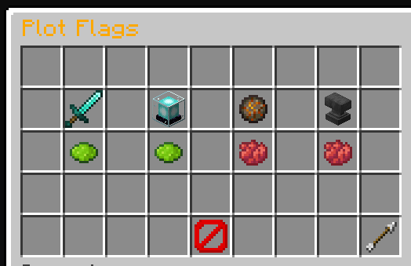

### PlotSquared Extension to view flags on a plot


### Important Notes
- required Plugins: PlotSquared & WorldEdit
- Version 1.0.0 only allows BooleanFlags = Flags that can only be "true" of "false"

### Configuration via config.yml
```yaml
# Messages & GUI Variables
messages: ...

# How to define Flags:
flags:
  - flag: #PlotSquared name for the flag (%value% will be replace with true or false)
    cmd: #Command to set the flag
    item: #Item to represent the flag (ItemStack Bukkit format)

#Example:
  - flag: "pvp" 
    cmd: "plot flag set pvp %value%"
    item:
      ==: org.bukkit.inventory.ItemStack
      v: 4189
      type: DIAMOND_SWORD

#Optional; 
    # Customize the values for the flags (instead of "Aktiviert"/"Deaktiviert)
    # Customize the %value% in the command
    enabled:
      changecmd: "rain"
      displayname: "§eKlares Wetter"
    disabled:
      changecmd: "clear"
      displayname: "§eRegen"
```